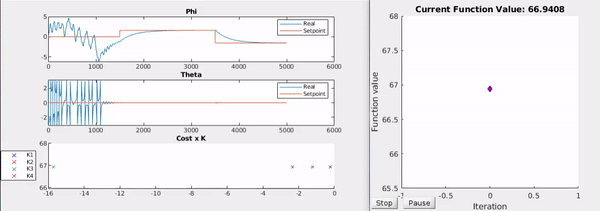

# Furuta-Cosimulation

This algorithm runs the simulation of the inverted pendulum iteratively to optimizes its controllers parameters.

With the mathematical model of the systems plant it is possible to simulate it in various conditions and 
evaluate its output. This algorithm finds a local minimum based on a previous calculated feedback controller.
The cost function of the system is the sum of the mean squere erros of all four states with weights assigned to each state
based on the linear–quadratic regulator (LQR) controll design.

#### The program plots the system response, K values (controller parameters ) and its cots for each step:  

###### Please check the following repositories of more information on this project.
###### Simulation and controller design : [Furuta-Simulation](https://github.com/feippolito/Furuta-Simulation)
###### Control implementation on real pendulum : [Furuta-Control](https://github.com/feippolito/Furuta-Control)
###### Hardware in the loop technique : [Furuta-HIL](https://github.com/feippolito/Furuta-HIL)
